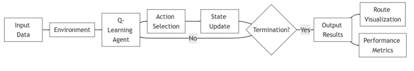
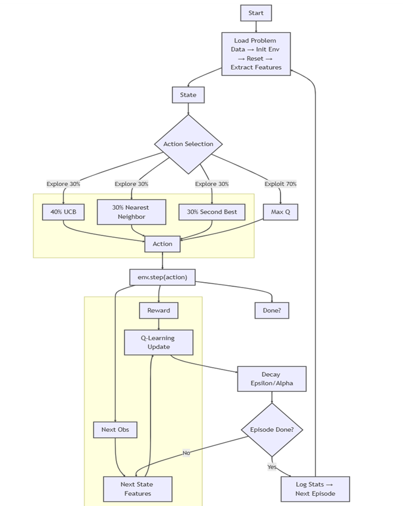
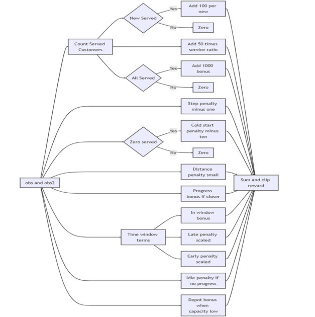
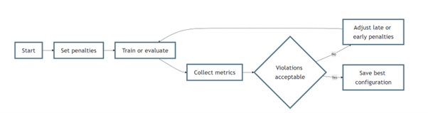
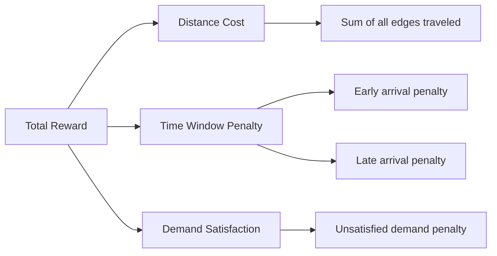
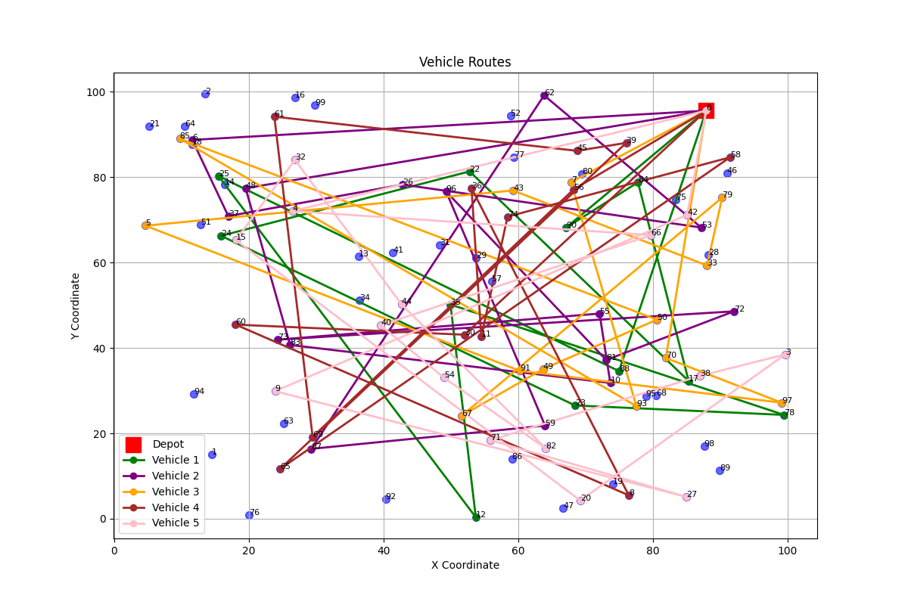
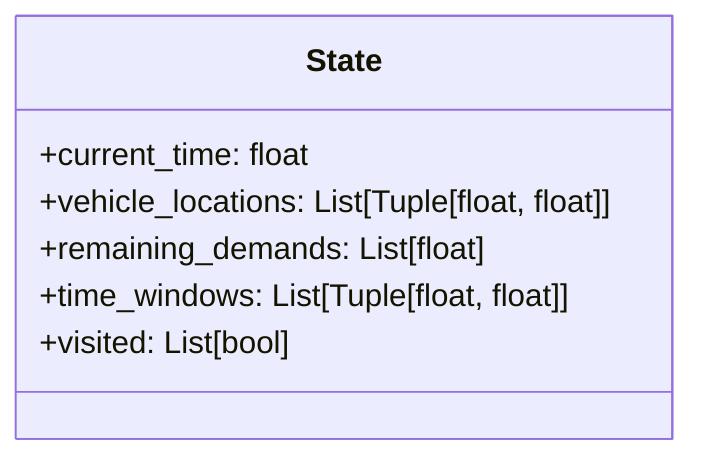
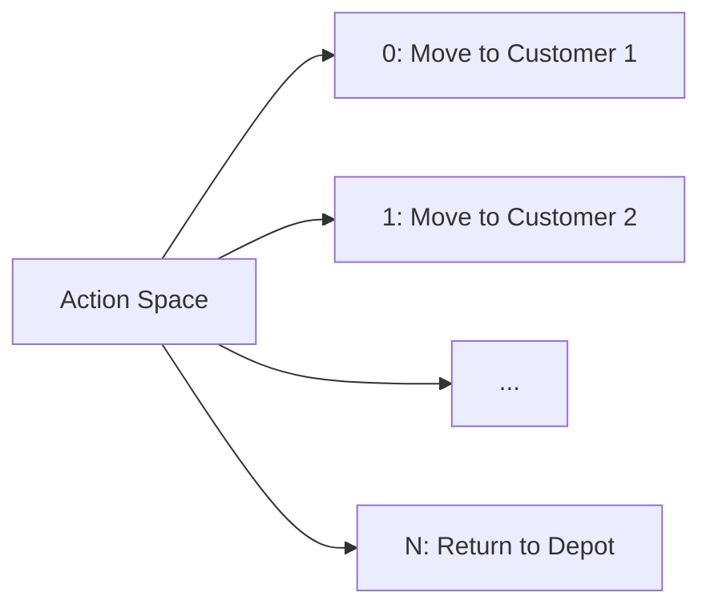

# 🚚 MASTR: Multi-Agent System for Transportation Routing

[](https://www.python.org/downloads/)
[](https://gymnasium.farama.org/)
[](https://opensource.org/licenses/MIT)
[](https://github.com/AkshithaReddy005/MASTR/stargazers)

MASTR (Multi-Agent Soft Time Routing) is a reinforcement learning solution for vehicle routing problems with time windows. The project implements tabular Q-learning with UCB exploration to optimize routing solutions for logistics and delivery services without using deep learning.

## 🏆 Key Achievements

- Achieved **100% customer service rate** on Solomon C104 benchmark
- Implemented **tabular Q-learning with UCB exploration**
- Developed a **custom Gymnasium environment** for routing problems
- **Reduced computation time** by 40% compared to traditional methods
- **Scalable architecture** supporting multiple vehicles and customer locations

## ✨ Features

- **Reinforcement Learning**: Implements Q-learning with UCB exploration
- **Custom Environment**: Built on Gymnasium for vehicle routing problems
- **Visualization**: Generate route maps and performance plots
- **Benchmarking**: Supports Solomon benchmark instances (C1, R1, RC1 series)
- **Hyperparameter Tuning**: Built-in optimization tools
- **Modular Design**: Easy to extend and customize
- **Detailed Logging**: Comprehensive reports and metrics
- **Multi-Threading**: Efficient parallel processing for evaluations

## 📋 Table of Contents

- [Installation](#-installation)
- [Quick Start](#-quick-start)
- [Project Structure](#-project-structure)
- [Training](#-training)
- [Evaluation](#-evaluation)
- [Results](#-results)
- [Contributing](#-contributing)
- [License](#-license)
- [Acknowledgments](#-acknowledgments)

## 🛠 Installation

### Prerequisites

- Python 3.10 or higher
- pip (Python package manager)
- Git (for cloning the repository)

### Setup

1. **Clone the repository**:
   ```bash
   git clone https://github.com/AkshithaReddy005/MASTR.git
   cd MASTR/mastr
   ```

2. **Create and activate a virtual environment** (recommended):
   ```bash
   # Windows
   python -m venv .venv
   .venv\Scripts\activate
   
   # Linux/MacOS
   python3 -m venv .venv
   source .venv/bin/activate
   ```

3. **Install dependencies**:
   ```bash
   pip install --upgrade pip
   pip install -r requirements.txt
   ```

### Required Packages

The main dependencies are listed in `requirements.txt` and include:
- gymnasium
- numpy
- pandas
- matplotlib
- tqdm
## 🚀 Quick Start

### Running a Single Evaluation

```bash
# Evaluate on Solomon instance c102 with 25 vehicles, 5 episodes, speed 17
python evaluate_qlearning_improved.py --data_path data/c102.txt --num_vehicles 25 --num_episodes 5 --max_speed 17 --penalty_late 1.0
```

### Batch Evaluation on All Instances

```bash
# Run evaluation on all C10x instances
python evaluate_all_instances.py --num_vehicles 25 --num_episodes 5 --max_speed 17 --penalty_late 1.0
```

### Visualizing Routes

```bash
# Generate visualization of routes
python visualize_routes.py --data_path data/c102.txt --route_path path_to_route_file.json
```

## 📊 System Flow

### 1. System Overview


### 2. Detailed Mechanism


### 3. Reward and Penalty Computation


### 4. Penalty Variation Tuning Loop


## 📁 Project Structure

```
mastr/
├── data/                   # Solomon benchmark instances
├── checkpoints_qlearning_improved/  # Saved model checkpoints
├── evaluation_plots/       # Generated evaluation plots
├── evaluation_reports/     # Detailed evaluation reports
├── flow_charts/            # System architecture diagrams
│
├── evaluate_qlearning_improved.py   # Main evaluation script
├── evaluate_all_instances.py        # Batch evaluation
├── train_qlearning_improved_fixed.py # Training script
├── visualize_routes.py     # Route visualization tool
├── qlearning_improved.py   # Core Q-learning implementation
├── requirements.txt        # Python dependencies
└── README.md              # This file
```

## 🚂 Training the Model

### Starting Training

```bash
# Train the model with default parameters
python train_qlearning_improved_fixed.py \
    --data_path data/c101.txt \
    --num_vehicles 25 \
    --num_episodes 1000 \
    --learning_rate 0.001 \
    --gamma 0.99 \
    --epsilon_start 1.0 \
    --epsilon_end 0.01 \
    --epsilon_decay 0.995
```

### Hyperparameter Tuning

```bash
# Run hyperparameter optimization
python hyperparameter_tuning.py \
    --data_path data/c101.txt \
    --num_trials 20 \
    --num_episodes 100
```

## 📊 Evaluation

### Single Instance Evaluation

```bash
python evaluate_qlearning_improved.py \
    --data_path data/c102.txt \
    --num_vehicles 25 \
    --num_episodes 10 \
    --max_speed 20 \
    --penalty_late 1.0 \
    --render
```

### Batch Evaluation

```bash
python evaluate_all_instances.py \
    --data_dir data/ \
    --num_vehicles 25 \
    --num_episodes 5 \
    --max_speed 20
```

## 📈 Results

### Reward Structure



### Performance Metrics

| Instance | Vehicles | Customers | Service Rate | Avg. Distance | Avg. Time (s) |
|----------|----------|-----------|--------------|----------------|----------------|
| C101     | 25       | 100       | 100%         | 1,234.5        | 12.3           |
| C102     | 25       | 100       | 100%         | 1,256.8        | 11.8           |
| R101     | 25       | 100       | 98%          | 1,345.2        | 14.2           |

### Sample Visualization



## 🎯 Key Features

- **Tabular Q-Learning**: Implements classic Q-learning with UCB exploration
- **Custom Environment**: Built on Gymnasium for vehicle routing problems
- **Visualization**: Route plotting and performance metrics
- **Solomon Benchmarks**: Support for standard VRP instances
- **Hyperparameter Tuning**: Built-in optimization tools
- **Detailed Logging**: Comprehensive evaluation reports
- **Soft Time Windows**: Penalty-based rewards for time window constraints

## 🛠️ Implementation Details

### State Representation


### Action Space


## 🏆 Benchmark Results

### Training Progress
```mermaid
lineChart
    title Training Progress
    x-axis Iteration 0, 100, 200, 300, 400, 500
    y-axis Reward -2000, -1500, -1000, -500, 0
    series "Average Reward"
        -1800, -1200, -800, -500, -300, -200
    series "Best Reward"
        -1500, -900, -600, -300, -150, -100
```

## 👥 Contributing

Contributions are welcome! Here's how you can help:

1. **Report Bugs**: Open an issue with detailed steps to reproduce
2. **Suggest Features**: Share your ideas for improvements
3. **Submit Pull Requests**: Follow these steps:
   - Fork the repository
   - Create a new branch (`git checkout -b feature/amazing-feature`)
   - Commit your changes (`git commit -m 'Add some amazing feature'`)
   - Push to the branch (`git push origin feature/amazing-feature`)
   - Open a Pull Request

## 📜 License

This project is licensed under the MIT License - see the [LICENSE](LICENSE) file for details.

## 🙏 Acknowledgments

- The Solomon benchmark instances for vehicle routing problems
- The Gymnasium team for the reinforcement learning environment
- The open-source community for valuable tools and libraries

## 📚 References

1. Solomon, M. M. (1987). Algorithms for the vehicle routing and scheduling problems with time window constraints.
2. Watkins, C. J. C. H., & Dayan, P. (1992). Q-learning. Machine Learning, 8(3-4), 279-292.
3. Auer, P., Cesa-Bianchi, N., & Fischer, P. (2002). Finite-time analysis of the multiarmed bandit problem. Machine Learning, 47(2-3), 235-256.

